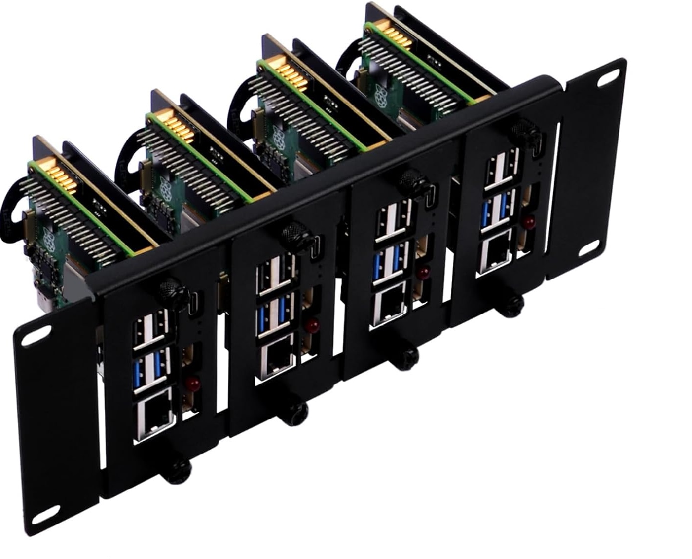
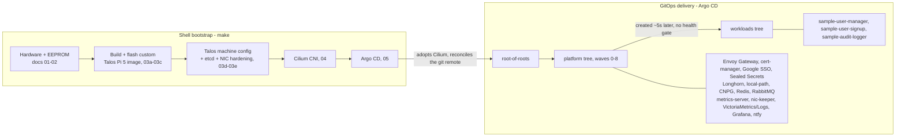

# offgrid

**A 3x Raspberry Pi 5 Kubernetes cluster on [Talos Linux](https://www.talos.dev/), networked by
[Cilium](https://cilium.io/), delivered by [Argo CD](https://argo-cd.readthedocs.io/).**


<p align="center">
  
</p>

> A personal homelab, documented end to end so you can follow it, learn from it, or adapt it. Not a one-click
> template: the OS image, network, domains and sizing are specific to my build. But the repo is a **numbered,
> ordered runbook**, so running the steps in sequence gets you a cluster.
> See **[Make it your own](#make-it-your-own)** for what an adopter has to change.

## Contents

- [Overview](#overview)
- [The stack](#the-stack)
- [Hardware](#hardware)
- [Architecture](#architecture)
- [Repository layout](#repository-layout)
- [Getting started](#getting-started)
- [Make it your own](#make-it-your-own)
- [Day-2 operations](#day-2-operations)
- [Troubleshooting](#troubleshooting)
- [Documentation](#documentation)
- [License](#license) and [Credits](#credits)

## Overview

- Three Raspberry Pi 5s, every node a control-plane node: HA etcd, workloads co-located.
- Booting Talos off NVMe. Talos ships no official Pi 5 image, so this repo builds its own: a custom installer
  with a Raspberry Pi kernel at 4K pages (Longhorn and XFS need that), plus the extensions the cluster needs.
- The shell steps do only what must exist before GitOps: flash Talos onto the NVMe, bootstrap etcd, install the
  Cilium CNI, install Argo CD.
- Everything after that is GitOps. Argo CD reconciles `argo_apps/` and delivers the platform (ingress, TLS, SSO,
  storage, databases, messaging, monitoring) plus the workloads on top.
- Config is two files: committed `versions.env` (the renovate-managed version recipe) and gitignored `.env`
  (copied from `.env.example`) for your config and secrets. Nothing is hardcoded in a script.
- Every app is a thin Helm wrapper chart pinning its upstream version. `docs/01` to `docs/14` hold the why.

## The stack

Everything after `04`/`05` is an Argo CD-delivered wrapper chart. Versions are pinned per chart (`Chart.yaml`)
and in `versions.env`; those files are the source of truth.

| Layer             | Component                      | Role                                                                                                         |
|-------------------|--------------------------------|--------------------------------------------------------------------------------------------------------------|
| **OS**            | Talos Linux                    | Immutable, API-driven Kubernetes OS. Custom Pi 5 NVMe image built in-repo (step 03).                         |
| **Network**       | Cilium                         | CNI + kube-proxy replacement, LB-IPAM + L2 announcements (LoadBalancer IPs), node-to-node WireGuard, Hubble. |
| **GitOps**        | Argo CD                        | Delivery engine; self-manages after bootstrap. Two-tree app-of-apps (platform and workloads).                |
| **Ingress**       | Envoy Gateway                  | Gateway API data plane; one Envoy on a single pinned LoadBalancer IP.                                        |
| **TLS**           | cert-manager                   | Let's Encrypt certificates via ClusterIssuers (HTTP-01, plus Cloudflare DNS-01 for wildcards).               |
| **Auth**          | Google SSO                     | Central OIDC per domain (Envoy `SecurityPolicy`, per-host email allowlists).                                 |
| **Secrets**       | Sealed Secrets                 | Encrypted secrets committed to git.                                                                          |
| **Storage**       | Longhorn                       | Replicated block storage, for Redis and the monitoring stores.                                               |
| **Storage**       | local-path-provisioner         | Node-local volumes, for Postgres and RabbitMQ, which replicate at the app layer.                             |
| **Database**      | CloudNativePG                  | Kubernetes-native PostgreSQL operator.                                                                       |
| **Cache**         | OpsTree Redis operator         | Standalone Redis instances, one per workload alias.                                                          |
| **Messaging**     | RabbitMQ                       | One shared broker; workloads declare their own topology.                                                     |
| **Metrics API**   | metrics-server                 | `metrics.k8s.io` for `kubectl top` and HPAs.                                                                 |
| **NIC**           | nic-keeper                     | Custom DaemonSet that keeps the flaky Pi 5 `macb` NIC and VIP healthy.                                       |
| **Observability** | VictoriaMetrics + VictoriaLogs | PromQL-compatible metrics and logs backend (over Prometheus/Mimir + Loki, for 8 GB nodes).                   |
| **Observability** | Grafana                        | Dashboards + alerting, provisioned as code. No persistence layer.                                            |
| **Alerting**      | ntfy                           | Self-hosted mobile push. No email.                                                                           |
| **Workloads**     | sample-user-manager + 2 more   | Demo app + Postgres + Redis + messaging + open/SSO ingress: the template for real workloads.                 |

Four shared charts under `lib/helm/` are consumed as `file://` dependencies, all `type: application`:

- `ingress`: the ingress edge (Gateway, HTTPRoute, ReferenceGrant, Certificate) from an `ingresses[]` list
- `pg-cluster`: a curated CloudNativePG Postgres wrapper
- `redis-instance`: a curated standalone OpsTree Redis wrapper
- `rabbitmq-topology`: a workload's messaging topology against the shared broker

## Hardware

3x Raspberry Pi 5 (8 GB), all control-plane, NVMe-booted, in a 10" 2U half-rack. The 4th bay is reserved for a
future 4GB worker. See [docs/01_hardware.md](docs/01_hardware.md).

| Component    | Choice                                       | Qty                  |
|--------------|----------------------------------------------|----------------------|
| SBC          | Raspberry Pi 5, 8 GB                         | 3                    |
| Rack         | GeeekPi DP-0046 (10" 2U)                     | 1                    |
| NVMe carrier | 52Pi RS-P11 boards                           | 4 (1 unused for now) |
| SSD          | Crucial P310 1 TB (CT1000P310SSD8, ~220 TBW) | 3                    |
| Power        | 27 W USB-C PD (5.1 V / 5 A)                  | 3                    |
| Cooling      | Pi 5 active cooler + aluminum heat sink      | 3                    |

Why these parts:

- Endurance-focused SSDs: all-control-plane means constant fsync-heavy etcd writes.
- 8 GB: headroom for co-locating etcd and workloads.
- Power delivery into the Pi's own USB-C port, which is the only way to get the full 5 A.

## Architecture

The shell bootstrap exists only to reach Argo CD. From there, git is the source of truth.

The root-of-roots creates the platform root first, then the workloads root about 5s later. It does NOT wait for
platform health: there is no `argoproj.io/Application` health gate, on purpose. So the boundary is advisory
creation-ordering. A workload that races ahead of a not-yet-present platform CRD fails its sync and converges on
its own via unbounded retry.



## Repository layout

```
.
|-- Makefile            # thin dispatcher over lib/shell; run `make help`
|-- versions.env        # committed version recipe (renovate-managed)
|-- .env.example        # template for config + secrets; copy to .env
|-- .env                # your config + secrets (gitignored)
|-- docs/               # the numbered runbook + decision records (01 to 14)
|-- terraform/          # the S3 backup bucket + its scoped IAM writer
|-- lib/
|   |-- shell/          # bootstrap shell scripts + helpers
|   |-- krr/            # the custom KRR rightsizing strategy
|   `-- helm/           # the 4 shared charts consumed as file:// dependencies
|-- argo_apps/          # everything Argo CD delivers (two-tree GitOps)
|   |-- root.yaml       #   root-of-roots (applied once by the 05 script)
|   |-- roots/          #   0_platform -> 1_workloads
|   |-- platform/{apps,charts}/
|   `-- workloads/{apps,charts}/
`-- secrets/            # gitignored: talos certs, talosconfig, kubeconfig, sealed key
```

The `NN_` prefixes mirror the sync-wave: the order Argo *creates* the apps in, roughly 5s apart, with no health
gate, so a later app that races ahead of a dependency just retries until it lands. See
[05_gitops](docs/05_gitops.md).

## Getting started

Only ever run on macOS, so Linux or WSL may need tweaks. The scripts assume a bash/zsh shell, GNU `make`, and a
POSIX-y environment.

On your machine:

- `docker` (with host networking), `git`, `kubectl`, `helm`, `yq`, `kubeseal`
- building the Talos image (03a) also needs `go`, `zstd`, `xz`, `jq`, `curl`
- no native `talosctl` needed: it runs dockerized via `make talosctl`, because the macOS build is unreliable
  however you install it

Instead of `make bootstrap-cluster` you can run steps 04 onward in runbook order. Every target maps to a script
in `lib/shell/`; `make help` lists them all.

```bash
# 0. Assemble the hardware (docs/01) and flash each Pi's EEPROM boot order (insert microSD into your laptop)
make build-eeprom-card              # 02 - write the EEPROM boot config to a microSD card (same card for all nodes)

# Now insert the SD card into each pi one-by-one, power on, wait for the LED to flash green rapidly, which means
# flashing is done, then power off and remove the card.

# 1. Configure - versions.env is committed; copy the config+secrets template
cp .env.example .env                # then edit: node IPs, domains, secrets. Go over everything, to be sure.

# 2. Build the custom Talos image
make build-talos-image              # 03a - build (+ optionally publish) a Talos image w/ custom kernel + extensions

# 3. Flash the NVMe drives: connect each NVMe to your laptop (e.g. via a USB adapter) and run, per drive:
make flash-talos-nvme               # 03b - write to each NVMe (repeat per drive)

# 4. Verify the nodes boot into Talos maintenance mode
make verify-talos-boot              # 03c - confirm each node boots into maintenance mode

# 5. Bootstrap the cluster
make bootstrap-cluster              # config + etcd + Cilium + Argo CD + seed secrets

# 6. Verify
make check-health                   # Talos cluster health
eval "$(make print-kubeconfig)"     # point kubectl at the cluster
kubectl get applications -n argocd  # watch Argo CD deliver the platform, then workloads
```

Per-phase reasoning and verification is in [the docs](#documentation).

## Make it your own

Edit `.env` (copied from `.env.example`) and expect to change at least:

- Topology and network: `CLUSTER_NODES` (hostnames + IPs), `CLUSTER_VIP`, `LB_RANGE_START`/`LB_RANGE_STOP`.
  Reserve each node IP in your router, and keep the VIP and LB pool on the nodes' L2, outside your DHCP range.
    - To reserve them: connect the Pis, read their MAC addresses off your router, then pin the intended IPs to
      those MACs in its DHCP settings.
- Domains and TLS: `LE_EMAIL`, plus your Google OAuth app (`GOOGLE_SSO_CLIENT_ID` + `GOOGLE_SSO_CLIENT_SECRET`).
  Add each exposed hostname to `argo_apps/platform/charts/04_google_sso`.
- Git remote: `REPO_URL` must equal the `repoURL` committed across `argo_apps/`. Argo CD reconciles the pushed
  remote, not your working tree, so commit and push before you expect a sync.
- Registry: `GHCR_USER`, and the GHCR tokens if you publish the installer image or use private images.
- Alerting: alerts reach your phone via self-hosted ntfy, no email. Set `NTFY_PHONE_PASSWORD_SECRET`, then
  post-boot run `make configure-ntfy-auth`. See `docs/09_monitoring.md`.
- Backups: off-cluster S3 needs the `AWS_DEPLOY_*` creds plus `S3_BACKUP_BUCKET`. See `docs/13_backups.md`.
- Secrets: every secret is optional. Leaving one empty disables the feature it enables (Google SSO, private GHCR
  pulls, Talos upgrades via pushed images, Argo CD private-repo access, ntfy, S3 backups).

Hardware caveats before you commit:

- The build assumes Raspberry Pi 5 + NVMe with all nodes control-plane.
- The kernel is custom-built at 4K pages, which Longhorn and XFS need.
- Not drop-in for other SBCs or for the stock Talos image. Start from
  [docs/03](docs/03_operating_system.md) if your hardware differs.

## Day-2 operations

| Task                      | Command                                                                          | Notes                                                                                                               |
|---------------------------|----------------------------------------------------------------------------------|---------------------------------------------------------------------------------------------------------------------|
| Upgrade Talos             | `make upgrade-talos`                                                             | Rolling A/B in-place to the pinned installer (03f) (bump `TALOS_VERSION` in `versions.env`)                         |
| Upgrade Kubernetes        | `make upgrade-k8s`                                                               | Rolling, no reboot (03g). (Bump `KUBERNETES_VERSION` in `versions.env`)                                             |
| Restore a datastore       | `make restore-cnpg`, `restore-redis`, `restore-longhorn`, `restore-vm`            | From the off-cluster S3 backups ([docs/13](docs/13_backups.md)).                                                     |
| Rightsize requests        | `make krr`                                                                       | Prints current requests next to what usage history suggests. Read-only; you hand-edit the chart values.             |
| Rebuild a running cluster | `make rebuild-cluster`                                                           | Wipes + rebuilds end-to-end, restores the sealed-secret key. Destructive to the persistence layer (cnpg, longhorn). |
| Reset all nodes           | `make reset-cluster`                                                             | Wipes back to maintenance mode. Destructive to the persistence layer (cnpg, longhorn).                              |
| Inspect                   | `make check-health`, `make talosctl <args>`, `eval "$(make print-kubeconfig)"`     | Read-only.                                                                                                           |

## Troubleshooting

- **`talosctl` misbehaves on macOS**: use the dockerized `make talosctl <args>`. A native client is not
  required ([docs/03](docs/03_operating_system.md)).
- **Nodes are `NotReady` after Talos bring-up**: expected until the Cilium CNI lands (`make install-cilium`, 04).
- **An Argo CD app is `OutOfSync` or "path does not exist"**: you did not git-push. Commit and push
  `argo_apps/**`, including any `Chart.lock` ([docs/05](docs/05_gitops.md)).
- **An app is permanently `OutOfSync` with nothing apparently wrong**: that is the orphan-not-delete signal. A
  stateful CR removed from a live app is kept, not pruned ([docs/13](docs/13_backups.md)).
- **LoadBalancer IP stuck `<pending>`**: the Cilium LB pool must be on the nodes' L2, avoiding the DHCP range
  and the VIP ([docs/04](docs/04_networking.md)).
- **Intermittent NIC drops on a Pi 5**: the `macb` wedge, handled by NIC hardening (03e) plus the `nic-keeper`
  DaemonSet ([docs/03](docs/03_operating_system.md)).

## Documentation

Each doc holds the why behind a step, with verification commands:

| Doc                                                | Covers                                                                          |
|----------------------------------------------------|---------------------------------------------------------------------------------|
| [01_hardware](docs/01_hardware.md)                 | Bill of materials + the reasoning behind every part.                            |
| [02_raspi_eeprom](docs/02_raspi_eeprom.md)         | Flashing a common Pi 5 EEPROM boot config.                                      |
| [03_operating_system](docs/03_operating_system.md) | Talos: OS choice, the custom Pi 5 image build, cluster bring-up, NIC hardening. |
| [04_networking](docs/04_networking.md)             | Cilium as CNI + LoadBalancer + WireGuard (the last imperative infra).           |
| [05_gitops](docs/05_gitops.md)                     | Argo CD, the two-tree app-of-apps, sync-wave convention.                        |
| [06_secrets](docs/06_secrets.md)                   | Sealed Secrets + the master-key custody you can't lose.                         |
| [07_ingress](docs/07_ingress.md)                   | Envoy Gateway, cert-manager, Let's Encrypt, central Google SSO.                 |
| [08_storage](docs/08_storage.md)                   | Longhorn, local-path-provisioner, CloudNativePG.                                |
| [09_monitoring](docs/09_monitoring.md)             | VictoriaMetrics + VictoriaLogs, Grafana, alerting, metrics-server.              |
| [10_sample_workload](docs/10_sample_workload.md)   | An end-to-end app + Postgres behind the Gateway.                                |
| [11_messaging](docs/11_messaging.md)               | The shared RabbitMQ broker and the per-workload topology chart.                 |
| [12_redis](docs/12_redis.md)                       | Standalone Redis instances, persistence modes, resizing.                        |
| [13_backups](docs/13_backups.md)                   | Off-cluster S3 backups for Postgres, Redis, Longhorn and the monitoring stores. |
| [14_renovate](docs/14_renovate.md)                 | Automated dependency updates and when Renovate is allowed to self-merge.        |
| [15_node_recovery](docs/15_node_recovery.md)       | Losing or replacing a node: etcd, Talos, Longhorn, CNPG, RabbitMQ.              |


## Credits

Built on the work of the Talos/[Sidero](https://www.talos.dev/), [Cilium](https://cilium.io/),
[Argo CD](https://argo-cd.readthedocs.io/), [cert-manager](https://cert-manager.io/),
[Envoy Gateway](https://gateway.envoyproxy.io/), [Sealed Secrets](https://github.com/bitnami-labs/sealed-secrets),
[Longhorn](https://longhorn.io/), [CloudNativePG](https://cloudnative-pg.io/),
[VictoriaMetrics](https://victoriametrics.com/) and [Grafana](https://grafana.com/) communities. The custom
Pi 5 Talos image builds on [talos-rpi5/talos-builder](https://github.com/talos-rpi5)

## License

MIT. See [LICENSE](LICENSE).

## Todos

- add a worker node (4th bay in the rack)
- check cnpg backup accumulation, ensure it doesn't build up too much. consider extending WAL backup time.
- migrate old pi stuff to cluster
- fork my personal cluster project for OSS version
- rewrite git history to remove secrets and email addresses and domains from past commits
- 
- look at all latest ntfy alerts, and check if they are actionable or just noise. if noise, change limits, or suggest how to deal with them.
- look at all latest error logs in the last 24h. noise or actionable? if noise, or suggest how to deal with them.-
- check all logs/hubble for network policies in audit more that are dropping traffic that should be allowed
- check log accumulation and metrics cardinality, drop noise so storage doesn't grow meaninglessly
- 
- read and shorten all md files.
- improve then apply comment rules from claude.md to all yaml and other code files.

- can we make sure that all longhorn-dependent pods get scheduled on a node that has that volume locally to reduce network latency and traffic?
- test and measure the performance (especially latency) impact of putting rabbitmq and cnpg onto longhorn-r2 (without backups) so that node-failure recovery is automatic'er
