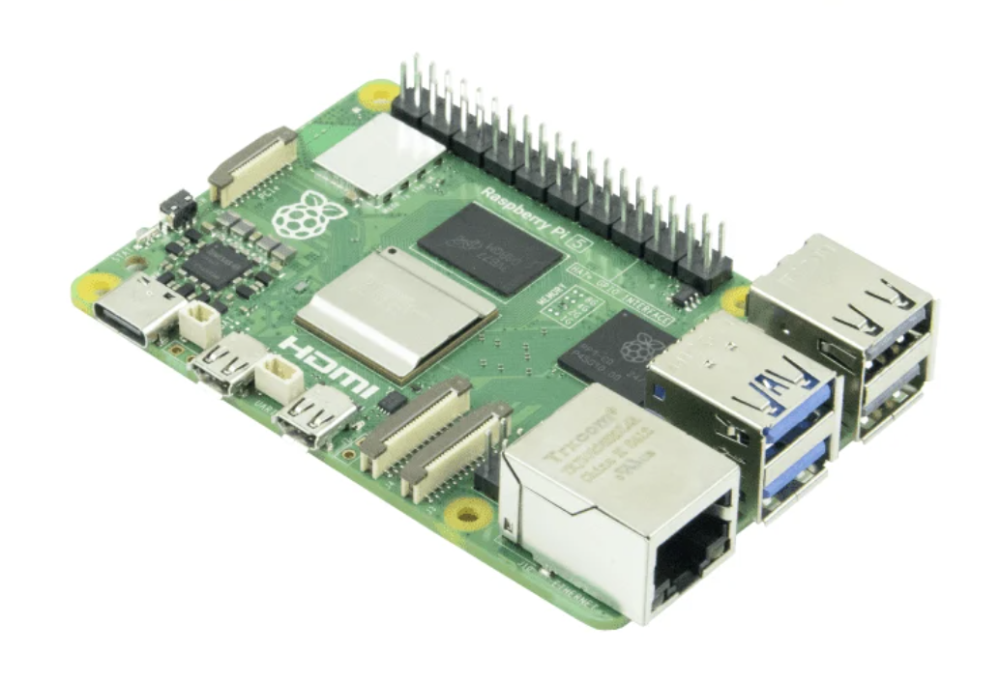
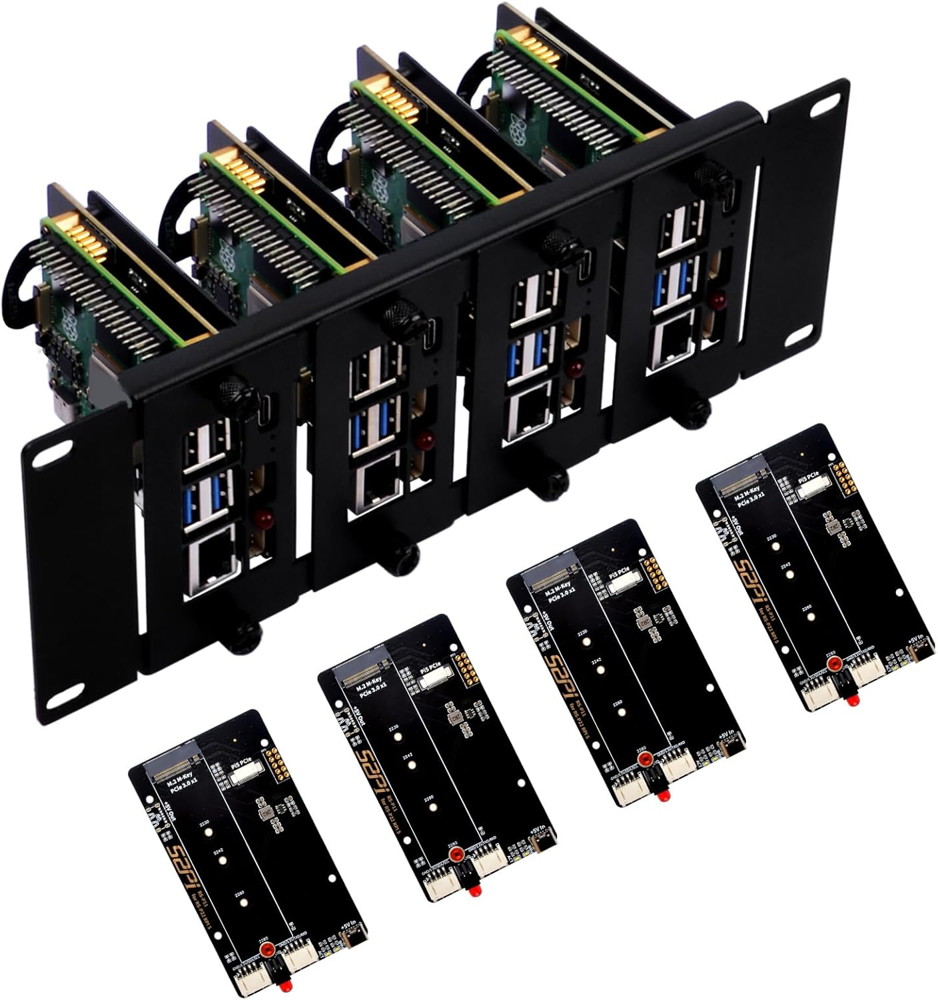
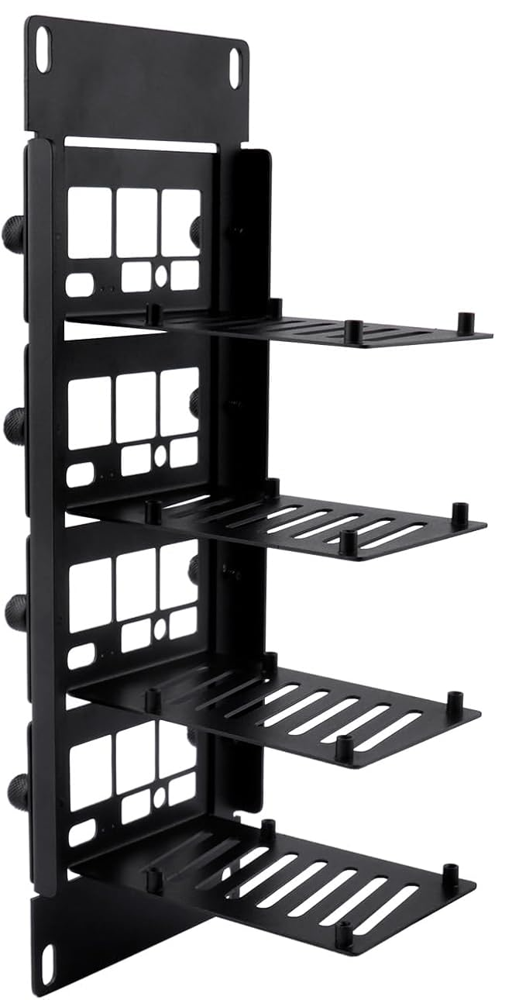
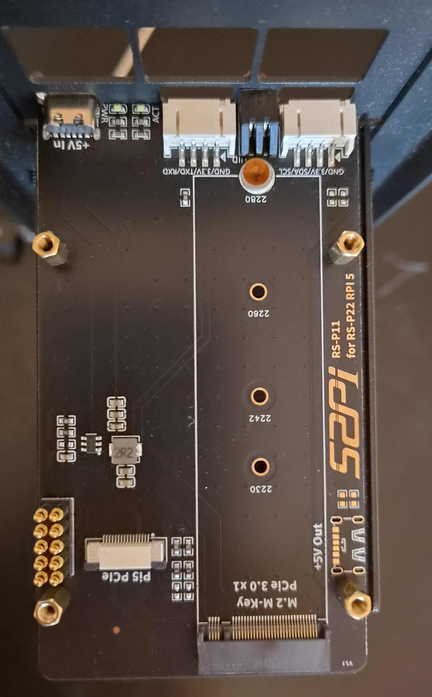
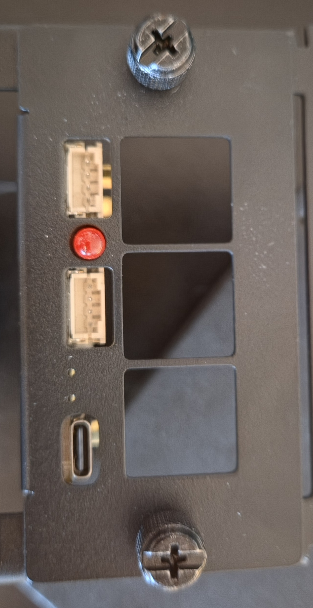
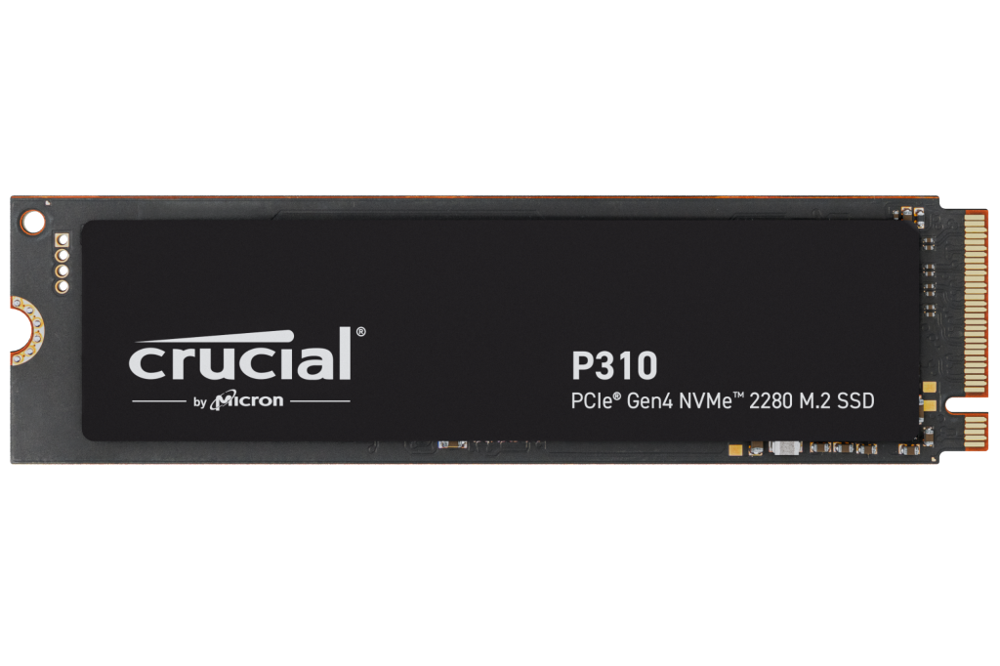
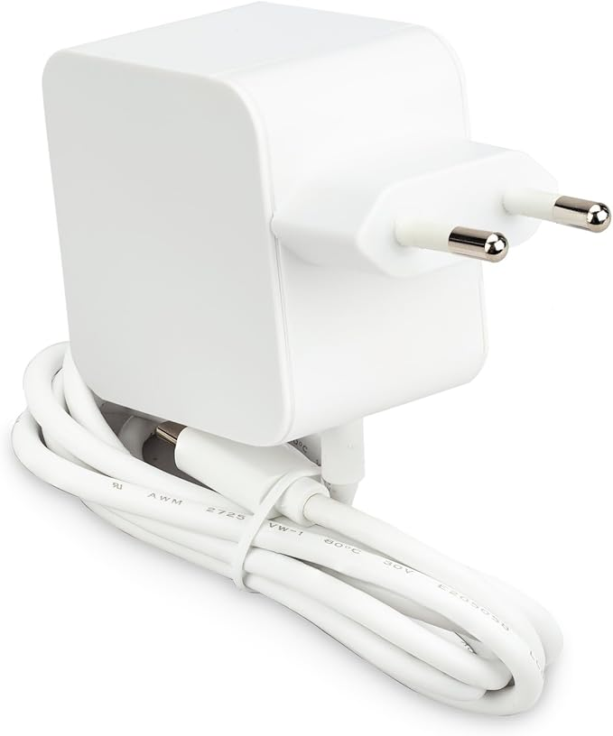
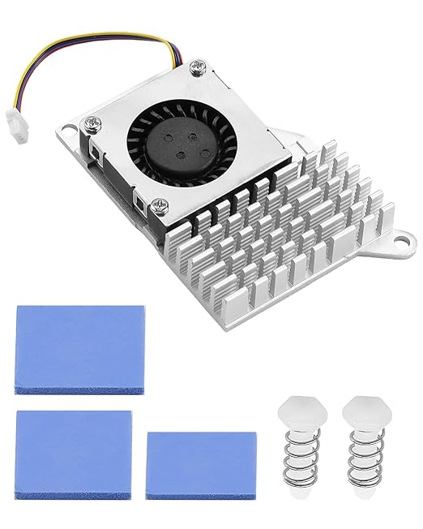
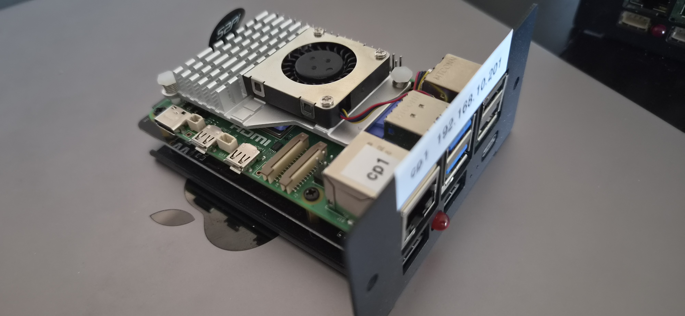
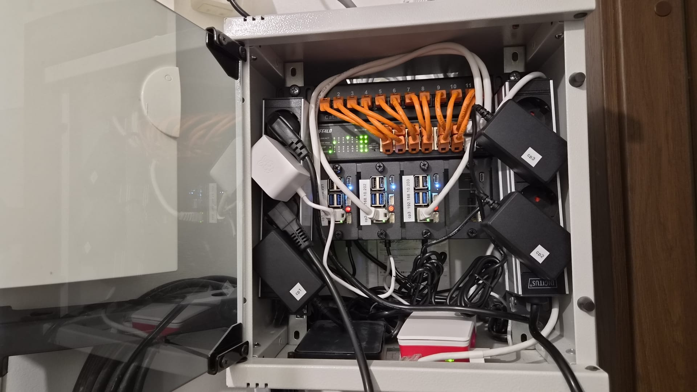

# Hardware

Three Raspberry Pi 5 nodes in a 10-inch 2U rack, all control-plane, booting from NVMe.

## Bill of materials

| Component  | Choice                                                 | Qty                   | OEM / reference                                                           |
|------------|--------------------------------------------------------|-----------------------|---------------------------------------------------------------------------|
| SBC        | Raspberry Pi 5, 8GB                                    | 3 (4th slot reserved) | [raspberrypi.com](https://www.raspberrypi.com/products/raspberry-pi-5/)   |
| Rack mount | GeeekPi DP-0046, 10" 2U mount + 4x RS-P11 NVMe boards  | 1 (kit)               | [wiki.deskpi.com](https://wiki.deskpi.com/rackmate_accessories_3/)        |
| NVMe board | 52Pi RS-P11 bottom board (4x incl. in the DP-0046 kit) | 4                     | [wiki.52pi.com](https://wiki.52pi.com/index.php?title=EP-0234)            |
| SSD        | Crucial P310 1TB 2280, bare PCB (CT1000P310SSD8)       | 3                     | [crucial.com](https://eu.crucial.com/ssd/p310/ct1000p310ssd8)             |
| PSU        | Raspberry Pi 27W USB-C PD (5.1V/5A)                    | 3                     | [raspberrypi.com](https://www.raspberrypi.com/products/27w-power-supply/) |
| Cooling    | Pi 5 active cooler (fan + alu heatsink)                | 3                     | [raspberrypi.com](https://www.raspberrypi.com/products/active-cooler/)    |

## Compute: 3x Raspberry Pi 5 (8GB)

- 8GB, because every node runs the control plane, etcd and workloads.
- 3 nodes give an odd etcd quorum that survives 1 failure. A worker holds no etcd, so it does not change that.
- The 4th bay takes a worker, which does not have to be a Pi. See [04_worker_nodes.md](04_worker_nodes.md).

## Rack mount: GeeekPi DP-0046 (10" 2U)

- Holds up to 4 Pi 5 boards and fits a standard 10-inch cabinet.
- DeskPi sells the same product as the "Rackmate 2U Rack Mount with PCIe NVMe Board". GeeekPi and DeskPi are
  sister brands.
- The kit includes one RS-P11 NVMe board per bay, so no separate NVMe HATs to buy.

## NVMe: bundled RS-P11 boards

The 52Pi RS-P11 ([EP-0234](https://wiki.52pi.com/index.php?title=EP-0234)) mounts under the Pi.

- M.2 M-key, 2230 to 2280. These nodes use 2280.
- Pi 5 PCIe is a single Gen2 lane, about 450 MB/s. Gen3 can be forced (`dtparam=pciex1_gen=3`, about 800-900
  MB/s), but it is unsupported and risks AER errors in a warm case. The load is light IO, so Gen2 stays.
- Power goes into the Pi's own side-facing USB-C port. Both USB-C inputs share one 5V rail over the GPIO pins,
  so that power also runs the NVMe on the RS-P11.
- The RS-P11's front USB-C port would be easier to reach, but it is not PD and cannot supply the full 5A.

## Storage: Crucial P310 1TB, bare PCB

Model CT1000P310SSD8, M.2 2280, about 220 TBW.

- Endurance is the spec that decides. Every node runs etcd, so every drive takes constant fsync and WAL writes.
- The Crucial E100 (about 80 TBW) was rejected: too little endurance for etcd writes around the clock.
- Buy the bare-PCB CT1000P310SSD8. The CT1000P310SSD5 is the same drive with a heat spreader, and it does not fit
  between the RS-P11 and the Pi.
- No heat sink is needed. The Gen2 lane throttles the drive, and it sees no sustained heavy IO.

## Power: 3x 27W USB-C PD

One 27W USB-C PSU per Pi, plugged into the Pi's own USB-C port.

- Plugged into the Pi, the PSU negotiates the full 5A (about 25W) over PD. The firmware then raises the USB port
  cap from 600mA to 1.6A. No EEPROM or `config.txt` change is needed.
- The budget, 5A (about 25W) for the whole stack:

| Load | Draw |
|---|---|
| Pi compute (SoC, RAM, fan) under full load | 1.8-2A |
| NVMe over PCIe, from the 5V rail, not the USB cap | 0.6-1A |
| The four USB-A ports together | capped at 1.6A (8W) |

- The full 5A leaves room for one bus-powered 2.5-inch HDD per Pi, which draws 4-5W. A second drive would need
  its own power.
- The cost: the Pi's USB-C port faces sideways and is harder to reach.

## Cooling: Pi 5 active cooler + thermal pads

A blower-style cooler with an aluminium heatsink and a PWM fan, one per board. The kit includes 3 thermal pads.

- CPU (BCM2712 SoC): 1 pad. It is the tallest die and the main contact.
- RP1 I/O chip: 2 pads stacked. RP1 sits lower than the SoC, and with one pad the cooler rocks. Two pads level
  it, so both chips get firm contact. RP1 carries USB, Ethernet, GPIO and PCIe, so it is the second-warmest chip.
- No pads on the other chips, such as the PMIC. The kit has only 3 pads, and those chips run warm, not hot.

## Assembled

